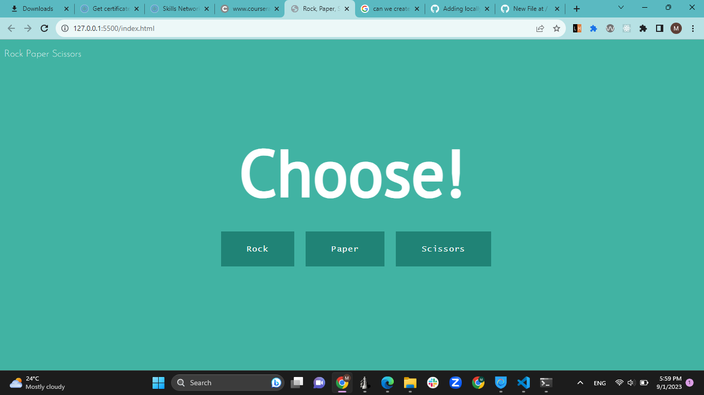

# Fundamentals-of-Javascript-through-rock-paper-scissors

## Description
The "Rock Paper Scissors" game is a simple JavaScript project that allows users to play the classic hand game against the computer. It's a fun and educational way to practice JavaScript fundamentals.

## Features
- Play Rock Paper Scissors against the computer.
- Randomized computer selections for added challenge.
- Simple and intuitive user interface.
